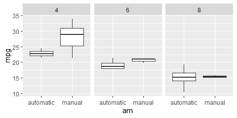
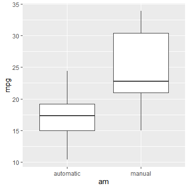
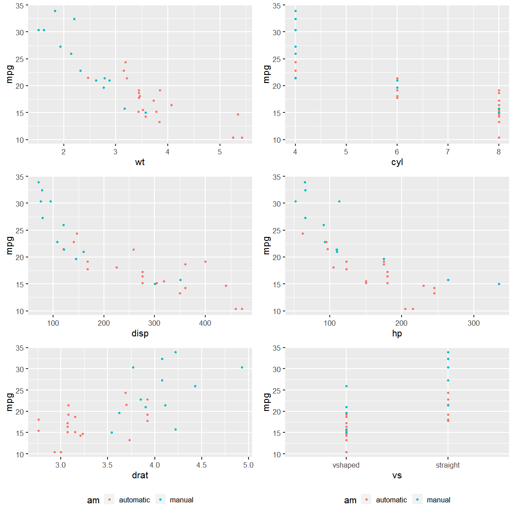
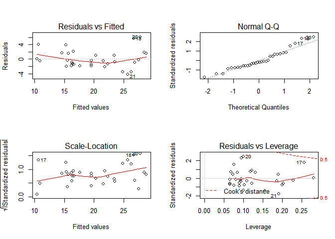

### 1. Executive Summary:

This report analyzes the relationship between fuel efficiency and transmission type for cars using the [mtcars](https://www.rdocumentation.org/packages/datasets/versions/3.6.2/topics/mtcars) dataset. The following questions are answered:

i) Is an automatic or manual transmission better for MPG
ii) Quantify the MPG difference between automatic and manual transmissions

**First**, exploratory data analysis has been done to identify the relationship between `mpg` (fuel efficiency) and `am` (transmission) and confounding variables affecting the relationship.
**Second**, several multivariable linear regression models are run to identify the model that best answers our questions.
**Third**, residual diagnostics are run on the chosen model. <br>

Our analysis has revealed that **transmission type has no effect on MPG** and thus there is no `mpg` difference between automatic and manual transmissions.

### 2. Exploratory Data Analysis (EDA):

**i) Steps**: **First**, we make the variables `am` and `vs` (engine type) as factor variables. **Second**, we summarize the dataset to view the summary statistics (Appendix A). **Third**, we plot `mpg` against `am` (Appendix B), and `mpg` against `am` controlling for `cyl`. **Fourth**, we plot `mpg` against other variables and color the points according to `am` (Appendix C) <br>

**ii) Inferences**: At first glance, Manual transmission seems to have a better `mpg`. However, after examining the effect of other variables (`cyl`, `disp`, `hp`, `wt`, `drat`), the relationship seems to vanish.


```r
data("mtcars"); setDT(mtcars)
mtcars[,`:=`(am = factor(am, labels=c('automatic','manual')), 
             vs = factor(vs, labels=c('vshaped','straight')))]
ggplot(data=mtcars) + geom_boxplot(mapping = aes(x=am, y=mpg)) + facet_grid(~cyl)
```

<!-- -->


### 3. Model Fitting and Selection:

**i) Steps**: We start by fitting a linear model between `mpg` and `am` and then we add other variables that were diagnosed as confounders in EDA. We first add `wt`, then we add `cyl` (`disp`, `hp` and `cyl` are similar variables for cars. Hence, we have taken one of these). Then, we add `drat` and `vs`. We then perform analysis of variance (ANOVA) for our five models. <br>

**ii) Inferences**: Based on the results of ANOVA, we choose Model 3 as it is statistically significant at 0.01% level and has low Residual sum of squares (RSS). 


```r
fit1 <- lm(mpg~am, data=mtcars) 
fit2 <- lm(mpg~am+wt, data=mtcars)
fit3 <- lm(mpg~am+wt+cyl, data=mtcars) 
fit4 <- lm(mpg~am+wt+cyl+drat, data=mtcars)
fit5 <- lm(mpg~am+wt+cyl+drat+vs, data=mtcars)
anova(fit1, fit2, fit3, fit4, fit5)[,1:6]
```

```
  Res.Df    RSS Df Sum of Sq       F    Pr(>F)    
1     30 720.90                                   
2     29 278.32  1    442.58 60.6635 2.911e-08 ***
3     28 191.05  1     87.27 11.9624  0.001884 ** 
4     27 191.00  1      0.05  0.0070  0.933857    
5     26 189.69  1      1.31  0.1796  0.675214    
---
Signif. codes:  0 '***' 0.001 '**' 0.01 '*' 0.05 '.' 0.1 ' ' 1
```

### 4. Analyzing the chosen Model:

**i) ** `am` **variable**: The model reveals a p value for 0.89 for `am` variable. Also, the 95% confidence interval for `am` includes 0. <br>

**ii) Residuals diagnostics (Appendix D)**: The distribution of residuals is random about the fitted values. Residuals are i.i.d. and are normally distributed as evident from the Q-Q plot.
    

```r
summary(fit3)$coefficients 
```

```
              Estimate Std. Error    t value     Pr(>|t|)
(Intercept) 39.4179334  2.6414573 14.9227979 7.424998e-15
ammanual     0.1764932  1.3044515  0.1353007 8.933421e-01
wt          -3.1251422  0.9108827 -3.4308942 1.885894e-03
cyl         -1.5102457  0.4222792 -3.5764148 1.291605e-03
```

```r
confint.lm(fit3) # par(mfrow = c(2,2)); plot(fit3)
```

```
                2.5 %     97.5 %
(Intercept) 34.007153 44.8287134
ammanual    -2.495555  2.8485408
wt          -4.991001 -1.2592836
cyl         -2.375245 -0.6452459
```

### 5. Conclusion:

i) There is not enough evidence at 5% significance level to conclude that manual transmission's `mpg` is different from that of automatic transmission. 
ii) Owing to the result above, we cannot conclude that at 5% significance level, the difference in `mpg` for two transmission types is different from 0.

### Appendix A: Summary Statistics of Variables


```r
summary(mtcars)
```

```
      mpg             cyl             disp             hp       
 Min.   :10.40   Min.   :4.000   Min.   : 71.1   Min.   : 52.0  
 1st Qu.:15.43   1st Qu.:4.000   1st Qu.:120.8   1st Qu.: 96.5  
 Median :19.20   Median :6.000   Median :196.3   Median :123.0  
 Mean   :20.09   Mean   :6.188   Mean   :230.7   Mean   :146.7  
 3rd Qu.:22.80   3rd Qu.:8.000   3rd Qu.:326.0   3rd Qu.:180.0  
 Max.   :33.90   Max.   :8.000   Max.   :472.0   Max.   :335.0  
      drat             wt             qsec              vs             am    
 Min.   :2.760   Min.   :1.513   Min.   :14.50   vshaped :18   automatic:19  
 1st Qu.:3.080   1st Qu.:2.581   1st Qu.:16.89   straight:14   manual   :13  
 Median :3.695   Median :3.325   Median :17.71                               
 Mean   :3.597   Mean   :3.217   Mean   :17.85                               
 3rd Qu.:3.920   3rd Qu.:3.610   3rd Qu.:18.90                               
 Max.   :4.930   Max.   :5.424   Max.   :22.90                               
      gear            carb      
 Min.   :3.000   Min.   :1.000  
 1st Qu.:3.000   1st Qu.:2.000  
 Median :4.000   Median :2.000  
 Mean   :3.688   Mean   :2.812  
 3rd Qu.:4.000   3rd Qu.:4.000  
 Max.   :5.000   Max.   :8.000  
```

### Appendix B: `mpg` vs `am` boxplot


```r
g <- ggplot(data=mtcars)
g + geom_boxplot(mapping = aes(x=am, y=mpg))
```

<!-- -->

### Appendix C: `mpg` vs other variables scatterplot (colour coded by `am`)


```r
g1 <- g + geom_point(mapping = aes(x=wt, y=mpg, col=am)) + theme_gray(base_size = 16) + theme(legend.position = 'none')
g2 <- g + geom_point(mapping = aes(x=cyl, y=mpg, col=am)) + theme_gray(base_size = 16) + theme(legend.position = 'none')
g3 <- g + geom_point(mapping = aes(x=disp, y=mpg, col=am)) + theme_gray(base_size = 16) + theme(legend.position = 'none')
g4 <- g + geom_point(mapping = aes(x=hp, y=mpg, col=am)) + theme_gray(base_size = 16) + theme(legend.position = 'none')
g5 <- g + geom_point(mapping = aes(x=drat, y=mpg, col=am)) + theme_gray(base_size = 16) + theme(legend.position = 'bottom')
g6 <- g + geom_point(mapping = aes(x=vs, y=mpg, col=am)) + theme_gray(base_size = 16) + theme(legend.position = 'bottom')

grid.arrange(g1, g2, g3, g4, g5, g6, nrow=3, ncol=2)
```

<!-- -->

### Appendix D: Residual Diagnostics


```r
par(mfrow = c(2,2)); plot(fit3)
```

<!-- -->


